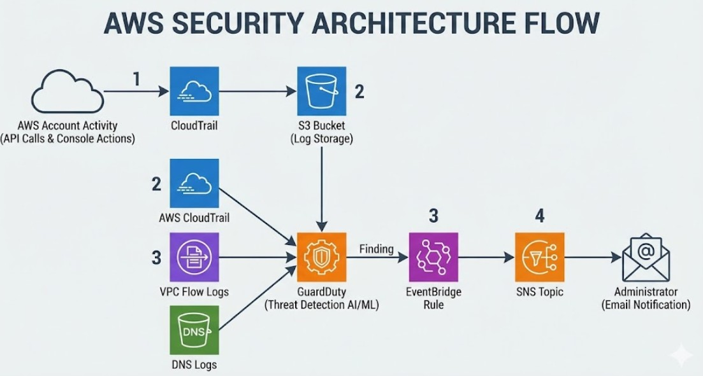
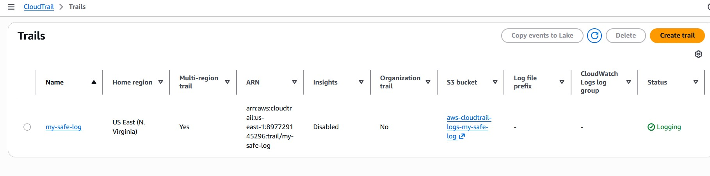
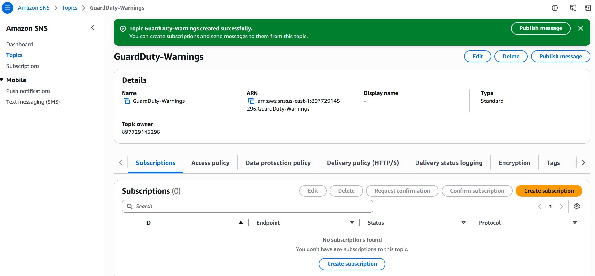
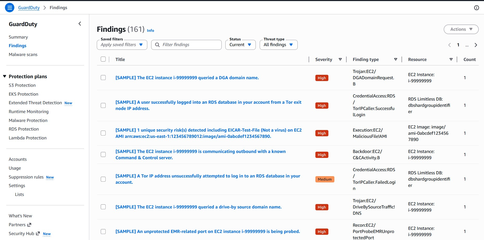
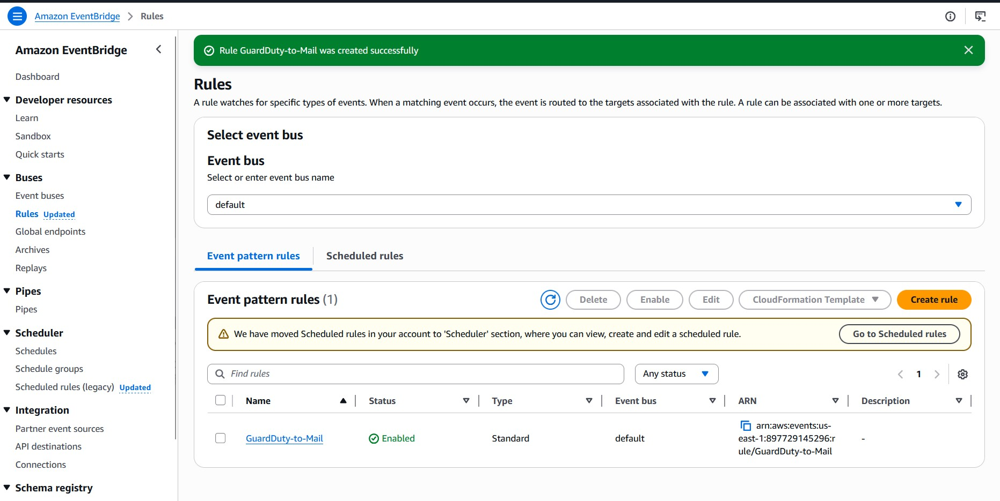
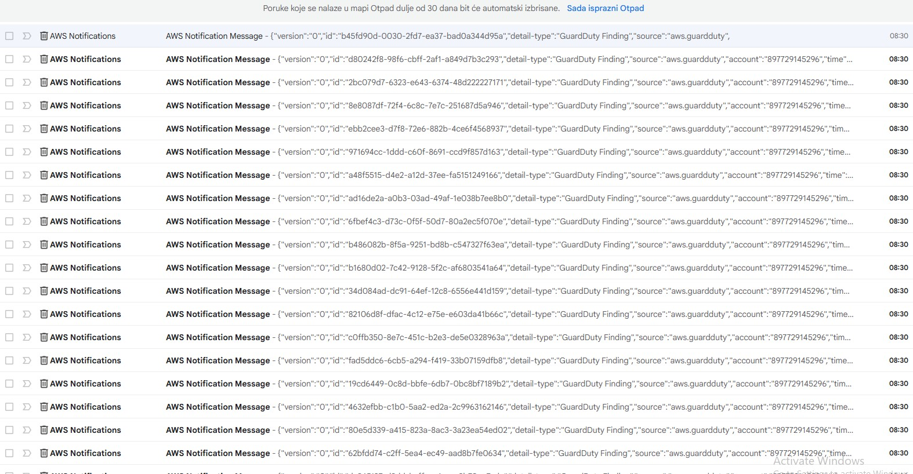

# aws-guardduty-security-monitoring
monitoring of all AWS account activities and automatically alert me in real-time if any malicious behavior was detected 

Tech Stack:

Data Logging:AWS CloudTrail, Amazon S3

Threat Detection (AI/ML):Amazon GuardDuty

Automation & Routing: Amazon EventBridge

Alerting: Amazon SNS (Simple Notification Service)

## Architecture Flow

1. CloudTrail continuously records all API calls and console actions across the AWS account and securely stores them in an S3 Bucket.
2. GuardDuty actively analyzes these CloudTrail logs, VPC Flow Logs, and DNS logs using machine learning to detect anomalies.
3. When GuardDuty detects a threat, it generates a "Finding" which triggers an EventBridge Rule.
4. The EventBridge rule pushes the alert to an SNS Topic, which instantly sends an email notification to the administrator.

## The Setup Process

Activated CloudTrail for my AWS account.

Enabled GuardDuty to provide intelligent threat detection.

Created an SNS topic and subscribed my email address to receive administrative alerts.

Configured EventBridge to listen specifically for `GuardDuty Findings` and route them directly to my SNS topic.

Generated sample findings in GuardDuty to simulate attacks and verify the end-to-end email delivery.

## Troubleshooting & Lessons Learned

I successfully created the SNS subscription and clicked the confirmation link in my email. However, in the AWS Console, the subscription ID showed up as `Deleted`, and I wasn't receiving any EventBridge alerts.
I realized that my email provider's automatic security/virus scanner had instantly triggered the "Unsubscribe" link hidden at the bottom of the initial AWS confirmation email. This immediately killed the SNS subscription.
I deleted the dead subscription, created a fresh one, and carefully confirmed it without triggering the unsubscribe link. The system immediately generated a valid ARN and alerts started flowing!

